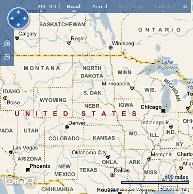
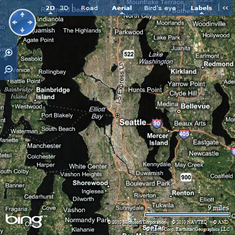
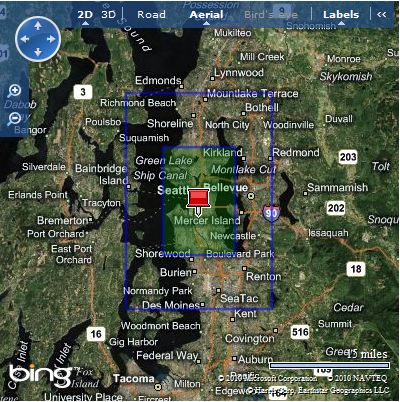
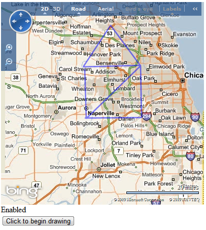

# WebSharper.Bing.Maps

[Bing Maps AJAX and REST](http://www.microsoft.com/maps/choose-your-bing-maps-API.aspx)
development support for
[WebSharper](http://bitbucket.org/IntelliFactory/websharper).

# Overview

This WebSharper Extension provides a set of classes almost identical
to the ones documented in the [Bing Maps API][bing-api]. When used in
WebSharper projects, these stub classes delegate the work to the
actual classes implemented in Bing Maps API.

This extension also provides helper functions and classes to invoke and
read responses from the [Bing Maps REST Services][bing-rest-api].

After adding the reference to the project all the classes can be found
under the `IntelliFactory.WebSharper.Bing.Maps` module.

Learn to use WebShaper.Bing.Maps:

# A Simple Map

Creating a map typically involves 3 steps:

  * Creating a container, an `Html` element for embedding the map object.

  * Initializing the map and attaching it to the container.

  * Setting properties, wiring events and adding shapes or controls to the
    attached map.

To initialize the map you need to supply your bing map key. More information on
how to retrieve a Bing Maps key is found at http://msdn.microsoft.com/en-us/library/ff428642.aspx.


The following example creates and initializes a simple map:

```fsharp
[<JavaScript>]
let MyCredentials = "Your Bing Maps Key"

[<JavaScript>]
let Test (f) =
    Div []
    |>! OnAfterRender (fun el ->
        let options =
            MapOptions(
                Credentials = MyCredentials,
                Width = 400,
                Height = 400
            )
        let map = Map(el.Body, options)
        f map
    )

    [<JavaScript>]
    let MapElement () =
    Test (fun map ->
         map.SetMapType(MapTypeId.Birdseye))
```

It is necessary to initialize the map using the `OnAfterRender` method since the
Bing Maps API requires that the container element is attached to the DOM before
the map is initialized. Doing the Map initialization after the widget rendering makes
sure that this condition holds.




The method `SetView` allows you to change the view parameters for the map. For example,
you can set the default location of the map by specifying a different latitude and
longitude. This is done through the `Location` class.

```fsharp 
[<JavaScript>]
let SetLocationProperties(map) =
    let location = Location(47.6, -122.33)
            location.Latitude <- 46.83
            let view = ViewOptions(Location = location,
                                   Zoom = 10,
                                   MapTypeId = Bing.MapTypeId.Birdseye)
    map.SetView(view)
```

This example shows how you can initialize the Location components directly from the
constructor or using mutation. This time we also used a 10x zoom and a `Birdseye` style
for the map.

Alternatively, you can also set view options when creating the map by passing a
`MapViewOptions` object to the map constructor. This object combines the properties of
`MapOptions` and `ViewOptions` for convenience.



# Shapes

The AJAX Map Control supports some drawing primitives like pushpins, lines and
polygons. The following example demonstrates how to add shapes to the map.

```fsharp
[<JavaScript>]
let Shapes() =     
    Test (fun map ->
        let location = Location(47.6,-122.33)
        let view = ViewOptions(Location = location,
                               Zoom = 9,
                               MapTypeId = MapTypeId.Aerial)

        // Pushpin
        let pushpin = Pushpin(location)
        map.Entities.Push pushpin

        let fromPoints (x,y) = Location(x + location.Latitude,
                                        y + location.Longitude)

        // Line
        let linePoints = 
            [|(0.2,0.2); (0.2,-0.2); (-0.2,-0.2); (-0.2,0.2); (0.2,0.2)|]
            |> Array.map fromPoints
        let line = PolyLine(linePoints)
        map.Entities.Push(line)

        // Polygon
        let polyPoints = 
            [|(0.1,0.1); (0.1,-0.1); (-0.1,-0.1); (-0.1,0.1)|]
            |> Array.map fromPoints
        let polygon = Polygon(polyPoints)
        map.Entities.Push(polygon)

        let pushpin2 = Pushpin(Bing.Location(47.3, -122.17)
        let pinOptions = PushpinOptions(
                             Draggable = true,
                             Icon = "my_pushpin_icon.png",
                             Width = 50,
                             Height = 50)
        map.Entities.Push(pushpin2, pinOptions)

        let polyOptions = PolygonOptions(StrokeColor = Color(200, 250, 190, 204),
                                         StrokeThickness = 12.)
        polygon.SetOptions(polyOptions)
    )
```

First, we use the `Test` function from the previous example. We create a Location
for selecting the center coordinate.

Having the map loaded in line 8, we start adding the different possible shapes to the map.
Adding a shape to the map is done in 3 steps:

 * Generating the `Location` object(s) on which the shape will be placed.
 * Instantiating the shape.
 * Adding the shape to the map.

In the case of the pushpin (Lines 10-12), we use the `Pushpin` to create it. We simply
pass it the location at which it will be placed.

The next 2 cases (polyline and polygon) work similarly, but take an array of Locations
instead of a single Location. The order in which the shape is drawn is based on the
order that is used in the array.

The last pushpin example also shows how to modify the appearence of a shape when creating it.
You just need to create a {Shapename}Options object with the desired options, and pass
it as an extra argument to the shape constructor.

You can also pass a {Shapename}Options object to the SetOptions method of a shape to modify
it after it has been created; its display will be modified automatically.

The end result is the following:



# Using events

The AJAX Map control provides multiple events to enable various
interactive behavior in the map. The WebSharper extension offers a
low level interface to such events with almost no overhead.

The following code simply alerts with the mouse position in screen coordinates
and in map coordinates whenever the user clicks on the map.

Full Code:

```fsharp
[<JavaScript>]
let RespondToClicks() =
    Test(fun map ->
        let displayLatLong (e : MouseEventArgs) =
            let center = (e.Target :?> Map).GetCenter()
            let pinLocation = pin.GetLocation()
            let pinPoint = map.TryLocationToPixel(pinLocation)
            let mousePoint = Point(float(e.GetX()), float(e.GetY()))
            let mouseLocation = map.TryPixelToLocation(mousePoint)
            let message =
                "pushpin (lat/lon): " + string pinLocation.Latitude +
                ", " + string pinLocation.Longitude +
                "\npushpin (screen x/y): " + string pinPoint.X +
                "," + string pinPoint.Y +
                "\nmouse (lat/lon): " + string mouseLocation.Latitude +
                ", " + string mouseLocation.Longitude +
                "\nmouse (screen x/y): " + string mousePoint.X +
                "," + string mousePoint.Y
            JavaScript.Alert message
        Events.AddHandler(map, MouseEvent.Click, displayLatLong)
        |> ignore
)
```

The way you can attach events to the map is by using the `AddHandler` static method
of the `Events` class. This method receives the entity impacted by the event
(either the map, a shape, or an entity collection like `map.Entities`), the name of
the event you want to use and a callback function. The available events can be found
in the `{EventType}Event` class, where `EventType` is one of:

  * `Mouse`, for events related to clicking and mouse movement;
  * `Key`, for events related to keyboard strokes;
  * `EntityCollection`, for events related to an entity inside an entity collection.
  * `Unit`, for events with no extra parameter (like `Maptypechanged` or `Targetviewchanged`).

The callback signature is `{EventType}EventArgs -> unit`, apart from `UnitEvent`s
for which the callback signature is `unit -> unit`. Common properties for the
`MouseEventArgs` and `KeyEventArgs` objects are:

  * `event.eventName` which gives the exact event that was fired (like `MouseEvent.Click`).
  * `event.originalEvent` which return the native browser event.
  * `event.handled` which is a mutable boolean. Set it to false if you don't
    want the default behavior to be fired after running the callback.

This example also shows how to translate between screen coordinates and latitude / longitude,
using the `TryLocationToPixel` and `TryPixelToLocation` methods of a `Map` object.



# The REST API

Bing Maps provides a REST API which can be used for a number of requests:

  * Search for a location by name, address or coordinates;
  * Ask for directions between two locations, or into a location;
  * Request a static map, ie. a simple image (as opposed to interactive
    AJAX maps)
  * Ask for metadata about the maps, such as information about the tiles.

This WebSharper Extension provides functions to build a request for this
REST API, and classes to process the results. These functions can be found
in the `IntelliFactory.WebSharper.Bing.Rest` module.

The following code calls the REST API to search for a given location and
displays it on the map. It skips most error checking for the sake of clarity.

```fsharp
[<JavaScript>]
let SearchAndDisplay(query) =
    Test(fun map ->
        let callback (response : RestResponse) =
            let resources = response.ResourceSets.[0].Resources
            if resources.Length <> 0 then
                let resource = resources.[0] :?> LocationResource
                let location = Location(resource.Point.Coordinates.[0],
                                        resource.Point.Coordinates.[1])
                let pin = Pushpin(location)
                map.Entities.Push(pin)
                let view = ViewOptions(Center = location)
                map.SetView(view)
        Rest.RequestLocationByQuery(credentials, query, callback)
    )
```

Most functions in the `Rest` module are called in the same way. They take
three arguments:

  * A string containing your Bing Maps credentials;
  * An object describing your request;
  * A callback function of type `RestResponse -> unit` which will be called
    with the data returned by Bing.

The RestResponse object contains some metadata about the information it returns.
The actual data is in the `ResourceSets` array field. This will generally contain
a unique element, which itself contains an array of `Resources` and an
`EstimatedTotal` of their number. If the search was unsuccessful then this array
is empty; else it contains the result data.

You can find a reference about the [RestResponse][rest-response-ref] object,
as well as each type of resource that can be retrieved: [locations][loc-ref],
[routes][route-ref] and [image metadata][metadata-ref].

The following more complex example requests a route between two locations
and returns the driving instructions in an HTML table.

```fsharp
[<JavaScript>]
let GetRouteInfo(origin, destination) =
    let callback (result : RestResponse) =
        let route = result.ResourceSets.[0].Resource.[0] :?> RouteResource
        let getItems (instructions : ItineraryItem[]) =
            Array.map (fun inst ->
                    TR [TD [Text inst.Instruction.Text]
                        TD [Text (string inst.TravelDistance + " " +
                                  string route.DistanceUnit)]]
                )
                instructions
        let instructionTableRows =
            route.RouteLegs
            |> Array.map (fun leg -> getItems leg.ItineraryItems)
            |> Array.concat
        Table instructionTableRows
    let waypoints =
        [|
            Waypoint origin
            Waypoint destination
        |]
    let request =
        RouteRequest(Waypoints = waypoints,
                     Avoid = [| Avoid.Tolls |])
    RequestRoute(credentials, request, callback)
```

Exceptions to the described protocol are the `StaticMapUrl` and `StaticMap`
functions, which simply need your credentials and request, and directly
return an image url and an `Img` element, respectively.

```fsharp
[<JavaScript>]
let GetStaticMap() =
    let pushpins =
        [|
            PushpinRequest(x = 47.1, y = 19.0, Label = "P1")
            PushpinRequest(x = 47.13, y = 19.17, IconStyle = 2)
        |]
    let req = StaticMapRequest(imagerySet = ImagerySet.Road,
                               CenterPoint = Point(47.2, 19.1),
                               Pushpin = pushpins)
    Div [ StaticMap(credentials, req) ]
```

[rest-response-ref]: http://msdn.microsoft.com/en-us/library/ff701707.aspx
[loc-ref]: http://msdn.microsoft.com/en-us/library/ff701725.aspx
[route-ref]: http://msdn.microsoft.com/en-us/library/ff701718.aspx
[metadata-ref]: http://msdn.microsoft.com/en-us/library/ff701712.aspx
[bing-api]: http://msdn.microsoft.com/en-us/library/gg427610.aspx
[bing-rest-api]: http://msdn.microsoft.com/en-us/library/ff701713.aspx

